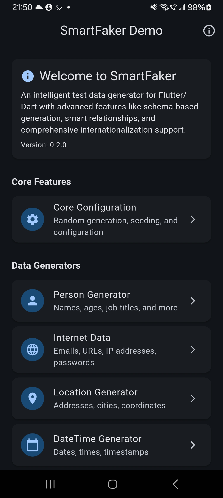
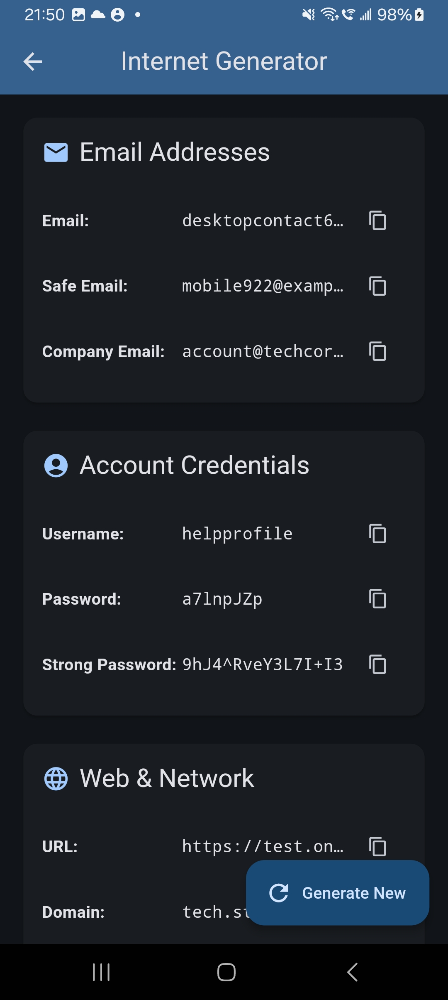
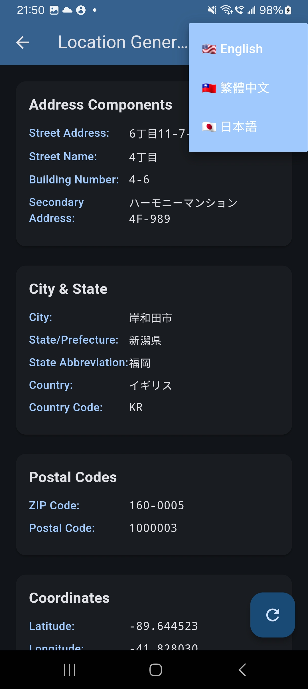
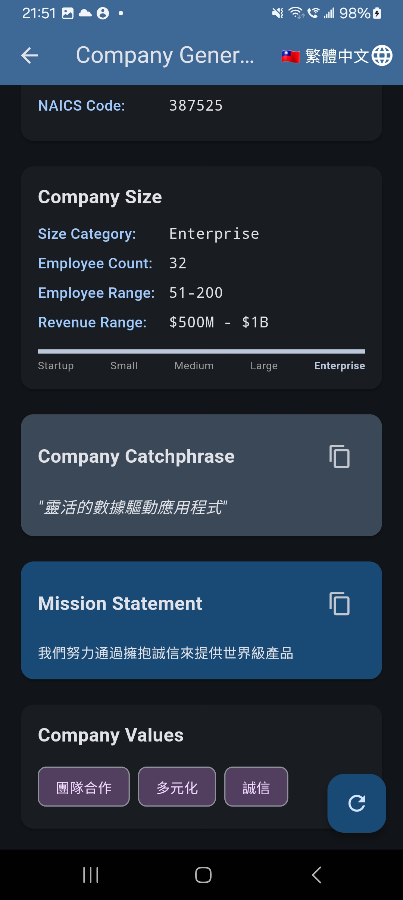
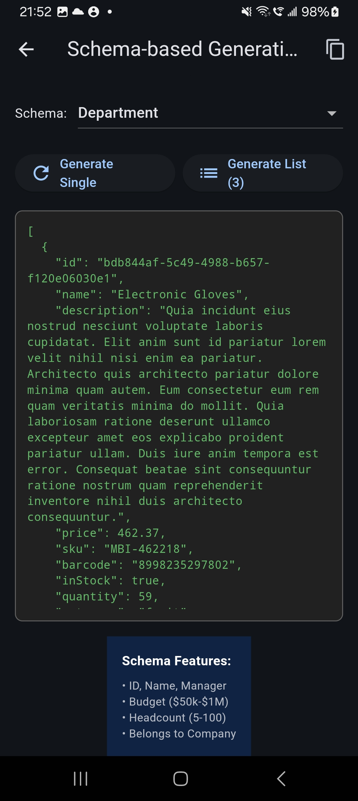
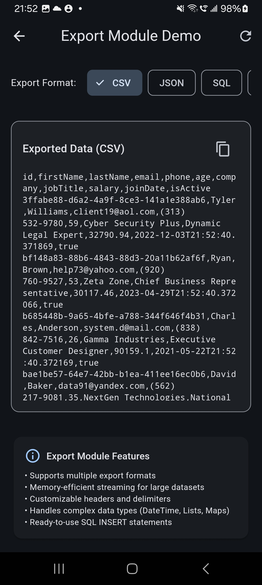

# SmartFaker

[](https://pub.dev/packages/smart_faker)
[](https://opensource.org/licenses/MIT)

A powerful and intelligent fake data generator for Flutter and Dart applications. SmartFaker provides comprehensive test data generation with smart relationships, internationalization support, and schema-based generation.

## Screenshots

<p align="center">
  
  
  
  
</p>
<p align="center">
  
  
  
</p>

**Version:** 0.4.0
**Last Updated:** 2025-09-16

## 📦 Resources

- **GitHub Repository:** [https://github.com/tienenwu/smart_faker](https://github.com/tienenwu/smart_faker)
- **Demo Application:** Available in the repository's `/demo` folder with comprehensive examples for all features
- **API Documentation:** [pub.dev/documentation/smart_faker](https://pub.dev/documentation/smart_faker/latest/)

## Features

- 🌍 **Multi-language Support**: English, Traditional Chinese (繁體中文), and Japanese (日本語)
- 🔗 **Smart Relationships**: Create realistic related data with consistent relationships
- 📊 **Schema-based Generation**: Define data structures and generate consistent fake data
- 🎯 **Type-safe API**: Fully typed interfaces for better IDE support and fewer runtime errors
- 🔄 **Reproducible Results**: Seed-based generation for consistent test data
- 🏗️ **Factory Patterns**: Multiple ways to integrate with your data classes
- ⚡ **High Performance**: Optimized for generating large datasets
- 🎨 **Rich Data Types**: 20+ modules covering person, internet, location, commerce, finance, and more
- 📤 **Data Export**: Export to CSV, JSON, SQL, XML, YAML, Markdown formats (New in v0.2.0!)
- 🇹🇼 **Taiwan Module**: Comprehensive Taiwan-specific data generation including ID numbers, tax IDs, and more (New in v0.2.0!)
- 🎯 **Pattern Module**: Generate data from regex patterns for validation-ready fake data (New in v0.3.0!)
- 🚀 **API Mocking**: Built-in mock server for testing API integrations with realistic data (New in v0.4.0!)

## Installation

Add `smart_faker` to your `pubspec.yaml`:

```yaml
dependencies:
  smart_faker: ^0.4.0
```

Then run:

```bash
flutter pub get
```

## Quick Start

### Basic Usage

```dart
import 'package:smart_faker/smart_faker.dart';

void main() {
  final faker = SmartFaker();
  
  // Generate basic data
  print(faker.person.fullName());        // "John Smith"
  print(faker.internet.email());         // "john.smith@example.com"
  print(faker.location.city());          // "New York"
  print(faker.commerce.productName());   // "Ergonomic Rubber Keyboard"
}
```

### Using Different Locales

```dart
// Traditional Chinese locale
final zhFaker = SmartFaker(locale: 'zh_TW');
print(zhFaker.person.fullName());      // "王小明"
print(zhFaker.location.city());        // "台北市"
print(zhFaker.company.name());         // "科技有限公司"

// Japanese locale
final jaFaker = SmartFaker(locale: 'ja_JP');
print(jaFaker.person.fullName());      // "山田太郎"
print(jaFaker.company.name());         // "株式会社山田"
print(jaFaker.location.city());        // "東京都"
```

### Reproducible Data with Seeds

```dart
// Same seed produces same data
final faker1 = SmartFaker(seed: 42);
final faker2 = SmartFaker(seed: 42);

print(faker1.person.fullName() == faker2.person.fullName()); // true
```

## Data Class Integration

### Method 1: Factory Constructor

```dart
class User {
  final String id;
  final String name;
  final String email;
  final int age;
  
  const User({
    required this.id,
    required this.name,
    required this.email,
    required this.age,
  });
  
  // Add factory constructor for fake data
  factory User.fake() {
    final faker = SmartFaker();
    return User(
      id: faker.random.uuid(),
      name: faker.person.fullName(),
      email: faker.internet.email(),
      age: faker.random.integer(min: 18, max: 65),
    );
  }
  
  // Generate multiple instances
  static List<User> fakeList(int count) {
    return List.generate(count, (_) => User.fake());
  }
}

// Usage
final user = User.fake();
final users = User.fakeList(10);
```

### Method 2: Extension Methods

```dart
class Product {
  final String id;
  final String name;
  final double price;
  
  const Product({
    required this.id,
    required this.name,
    required this.price,
  });
}

// Add fake data generation via extension
extension ProductFaker on Product {
  static Product fake() {
    final faker = SmartFaker();
    return Product(
      id: faker.random.uuid(),
      name: faker.commerce.productName(),
      price: faker.commerce.price(min: 9.99, max: 999.99),
    );
  }
}

// Usage
final product = ProductFaker.fake();
```

## Schema-based Generation

Define complex data structures with relationships:

```dart
final faker = SmartFaker();
final builder = SchemaBuilder(faker);

// Define User schema
final userSchema = SchemaBuilder.defineSchema('User')
  .id()
  .withName()
  .withContact()
  .field('age', FakerFieldType.integer, min: 18, max: 65)
  .withTimestamps()
  .build();

// Define Order schema with relationships
final orderSchema = SchemaBuilder.defineSchema('Order')
  .id()
  .belongsTo('userId', 'User')
  .field('total', FakerFieldType.amount, min: 10, max: 1000)
  .field('status', FakerFieldType.word)
  .withTimestamps()
  .build();

// Register schemas
builder.registerSchema(userSchema);
builder.registerSchema(orderSchema);

// Generate data with relationships
final order = builder.generate('Order');
print(order); // Order with valid userId reference
```

## Smart Relationships

Create realistic related data with consistent relationships:

```dart
final faker = SmartFaker();
final manager = RelationshipManager(faker);
final relationshipBuilder = SmartRelationshipBuilder(
  manager: manager,
  faker: faker,
);

// One-to-Many: User with Posts
final user = relationshipBuilder.oneToMany(
  parentSchema: 'User',
  childSchema: 'Post',
  parent: {
    'name': faker.person.fullName(),
    'email': faker.internet.email(),
  },
  childrenGenerator: (userId) => List.generate(3, (_) => {
    'title': faker.lorem.sentence(),
    'content': faker.lorem.paragraph(),
    'authorId': userId,
  }),
);

// Many-to-Many: Users and Roles
final pivotData = relationshipBuilder.manyToMany(
  schema1: 'User',
  schema2: 'Role',
  pivotSchema: 'UserRole',
  items1: users,
  items2: roles,
);

// Hierarchical: Organization Structure
final orgChart = relationshipBuilder.hierarchy(
  schema: 'Department',
  nodeGenerator: (depth, parentId) => {
    'name': faker.commerce.department(),
    'budget': faker.finance.amount(min: 50000, max: 500000),
  },
  maxDepth: 3,
  childrenPerNode: 4,
);
```

## Available Modules

### Person Module
```dart
faker.person.firstName()      // "John"
faker.person.lastName()       // "Smith"
faker.person.fullName()       // "John Smith"
faker.person.prefix()         // "Mr."
faker.person.suffix()         // "Jr."
faker.person.gender()         // "Male"
faker.person.jobTitle()       // "Senior Developer"
```

### Internet Module
```dart
faker.internet.email()        // "user@example.com"
faker.internet.username()     // "cooluser123"
faker.internet.password()     // "SecurePass123!"
faker.internet.url()          // "https://example.com"
faker.internet.ipv4()         // "192.168.1.1"
faker.internet.ipv6()         // "2001:0db8:85a3::8a2e:0370:7334"
faker.internet.macAddress()   // "00:1B:44:11:3A:B7"
faker.internet.userAgent()    // "Mozilla/5.0..."
faker.internet.domainName()   // "example.com"
```

### Location Module
```dart
faker.location.country()      // "United States"
faker.location.city()          // "New York"
faker.location.state()         // "California"
faker.location.zipCode()       // "10001"
faker.location.streetAddress() // "123 Main St"
faker.location.latitude()      // 40.7128
faker.location.longitude()     // -74.0060
faker.location.coordinates()   // Coordinates object
faker.location.timeZone()      // "America/New_York"
```

### Commerce Module
```dart
faker.commerce.productName()   // "Ergonomic Cotton Keyboard"
faker.commerce.price()         // 29.99
faker.commerce.category()      // "Electronics"
faker.commerce.department()    // "Home & Garden"
faker.commerce.sku()           // "SKU-12345"
faker.commerce.barcode()       // "123456789012"
faker.commerce.color()         // "Blue"
faker.commerce.material()      // "Cotton"
```

### Company Module
```dart
faker.company.name()           // "Acme Corporation"
faker.company.catchphrase()    // "Innovative solutions for tomorrow"
faker.company.industry()       // "Technology"
faker.company.employeeCount()  // 150
faker.company.revenue()        // 5000000.00
faker.company.foundedYear()    // 1995
```

### Finance Module
```dart
faker.finance.amount()         // 1234.56
faker.finance.creditCardNumber() // "4532-1234-5678-9012"
faker.finance.creditCardCVV()  // "123"
faker.finance.iban()           // "GB82WEST12345698765432"
faker.finance.bic()            // "DEUTDEFF"
faker.finance.currencyCode()   // "USD"
faker.finance.currencyName()   // "US Dollar"
faker.finance.currencySymbol() // "$"
faker.finance.accountNumber()  // "12345678"
faker.finance.routingNumber()  // "021000021"
faker.finance.bitcoinAddress() // "1A1zP1eP5QGefi2DMPTfTL5SLmv7DivfNa"
faker.finance.ethereumAddress() // "0x742d35Cc6634C0532925a3b844Bc9e7595f0bEb7"
```

### DateTime Module
```dart
faker.dateTime.past()          // DateTime in the past year
faker.dateTime.future()        // DateTime in the next year
faker.dateTime.recent()        // DateTime in the past week
faker.dateTime.soon()          // DateTime in the next week
faker.dateTime.between(start, end) // DateTime between two dates
faker.dateTime.month()         // "January"
faker.dateTime.weekday()       // "Monday"
faker.dateTime.timezone()      // "UTC"
```

### Lorem Module
```dart
faker.lorem.word()             // "dolor"
faker.lorem.words(5)           // "lorem ipsum dolor sit amet"
faker.lorem.sentence()         // "Lorem ipsum dolor sit amet."
faker.lorem.sentences(3)       // Multiple sentences
faker.lorem.paragraph()        // Full paragraph
faker.lorem.paragraphs(2)      // Multiple paragraphs
faker.lorem.lines(5)           // Multiple lines
```

### Image Module
```dart
faker.image.avatar()           // Avatar URL
faker.image.localAvatar()      // Base64 SVG avatar
faker.image.imageUrl()         // "https://picsum.photos/640/480"
faker.image.base64Image()      // Base64 encoded image
faker.image.svgImage()         // SVG string
faker.image.dataUri()          // "data:image/svg+xml;base64,..."
```

### Phone Module
```dart
faker.phone.number()           // "+1 (555) 123-4567"
faker.phone.phoneNumberFormat() // "(555) 123-4567"
faker.phone.countryCode()      // "+1"
faker.phone.areaCode()         // "555"
faker.phone.exchangeCode()     // "123"
faker.phone.subscriberNumber() // "4567"
```

### Export Module (New in v0.2.0!)
```dart
// Generate data
final users = List.generate(10, (_) => {
  'id': faker.random.uuid(),
  'name': faker.person.fullName(),
  'email': faker.internet.email(),
});

// Export to various formats
faker.export.toCSV(users)       // CSV format
faker.export.toJSON(users, pretty: true)  // Pretty JSON
faker.export.toSQL(users, table: 'users') // SQL inserts
faker.export.toMarkdown(users)  // Markdown table
faker.export.toXML(users)       // XML format
faker.export.toYAML(users)      // YAML format

// Stream large datasets (memory efficient)
final stream = Stream.fromIterable(largeDataList);
await for (final chunk in faker.export.streamCSV(stream)) {
  // Process chunks
}
```

### Taiwan Module (New in v0.2.0!)
```dart
// Set locale to zh_TW to access Taiwan module
final faker = SmartFaker(locale: 'zh_TW');

// Taiwan-specific generators
faker.taiwan.idNumber()         // "A123456789" (身分證字號)
faker.taiwan.companyTaxId()     // "12345678" (統一編號)
faker.taiwan.landlineNumber()   // "(02) 1234-5678"
faker.taiwan.postalCode()       // "100" or "10058" (5-digit)
faker.taiwan.licensePlate()     // "ABC-1234"
faker.taiwan.bankAccount()      // "004-1234-12345678901234"
faker.taiwan.healthInsuranceNumber() // "AB12345678"

// Enhanced Taiwan phone numbers
faker.phone.number()            // "0912-345-678" (with real carrier prefixes)
```

### Pattern Module (New!)
```dart
// Generate data from regex patterns
faker.pattern.fromRegex(r'^\d{5}$')         // "12345"
faker.pattern.fromRegex(r'^[A-Z]{3}-\d{4}$') // "ABC-1234"
faker.pattern.fromRegex(r'^09\d{8}$')       // "0912345678"

// Use preset patterns for common formats
faker.pattern.taiwanPhone()      // "0912-345-678"
faker.pattern.taiwanIdFormat()   // "A123456789"
faker.pattern.usPhone()          // "(555) 123-4567"
faker.pattern.japanPhone()       // "090-1234-5678"
faker.pattern.emailFormat()      // "john.doe@example.com"
faker.pattern.visaFormat()       // "4532 1234 5678 9012"
faker.pattern.mastercardFormat() // "5412 3456 7890 1234"
faker.pattern.orderIdFormat()    // "ORD-1234567890"
faker.pattern.skuFormat()        // "SKU-123456"
faker.pattern.ipv4Format()       // "192.168.1.1"
faker.pattern.macAddressFormat() // "00:1B:44:11:3A:B7"
faker.pattern.hexColorFormat()   // "#FF5733"
faker.pattern.uuidFormat()       // "550e8400-e29b-41d4-a716-446655440000"

// Custom order ID with prefix
faker.pattern.orderIdFormat(prefix: 'INV') // "INV-1234567890"

// Custom invoice with year
faker.pattern.invoiceFormat(year: 2025)    // "INV-20251234567"
```

### Schema Validation (New in v0.3.0!)
```dart
// Define schema with regex pattern validation
final schema = SchemaDefinitionBuilder('User')
  .field(
    'taiwanId',
    FakerFieldType.custom,
    pattern: r'^[A-Z][12]\d{8}$',  // Regex pattern for generation
    validator: FieldValidators.taiwanId,  // Validation function
    validationMessage: 'Invalid Taiwan ID format',
  )
  .field(
    'email',
    FakerFieldType.email,
    validator: FieldValidators.email,
  )
  .field(
    'phone',
    FakerFieldType.custom,
    pattern: r'^09\d{8}$',
    validator: FieldValidators.regex(r'^09\d{8}$'),
  )
  .field(
    'age',
    FakerFieldType.integer,
    min: 18,
    max: 65,
    validator: FieldValidators.range(min: 18, max: 65),
  )
  .build();

// Built-in validators
FieldValidators.email(value)        // Email validation
FieldValidators.phone(value)        // Phone validation
FieldValidators.url(value)          // URL validation
FieldValidators.creditCard(value)   // Credit card validation
FieldValidators.uuid(value)         // UUID validation
FieldValidators.taiwanId(value)     // Taiwan ID validation
FieldValidators.ipv4(value)         // IPv4 validation
FieldValidators.macAddress(value)   // MAC address validation
FieldValidators.hexColor(value)     // Hex color validation

// Utility validators
FieldValidators.length(min: 3, max: 20)  // Length validation
FieldValidators.range(min: 0, max: 100)  // Number range validation
FieldValidators.inList(['A', 'B', 'C'])  // Value in list validation
FieldValidators.regex(r'^[A-Z]{3}$')     // Custom regex validation
FieldValidators.combine([...])           // Combine multiple validators

// Use preset patterns
FieldPatterns.taiwanId     // '^[A-Z][12]\\d{8}$'
FieldPatterns.visa          // '^4\\d{15}$'
FieldPatterns.email         // '^[\\w\\.-]+@[\\w\\.-]+\\.\\w+$'
FieldPatterns.ipv4          // IPv4 pattern
FieldPatterns.macAddress    // MAC address pattern
```

### Additional Modules

- **Vehicle**: VIN, license plates, makes, models
- **System**: file paths, MIME types, file extensions, semver
- **Color**: hex colors, RGB, HSL, color names
- **Crypto**: bitcoin/ethereum addresses, hashes
- **Food**: dishes, ingredients, restaurants, cuisines
- **Music**: genres, artists, songs, albums, instruments

## Advanced Usage

### Batch Generation

```dart
// Generate multiple items efficiently
final faker = SmartFaker(seed: 42);

// Generate 100 users with consistent relationships
final users = List.generate(100, (_) => User.fake());

// Generate related data
final posts = <Map<String, dynamic>>[];
for (final user in users) {
  final userPosts = List.generate(
    faker.random.integer(min: 1, max: 5),
    (_) => {
      'userId': user.id,
      'title': faker.lorem.sentence(),
      'content': faker.lorem.paragraphs(3),
      'publishedAt': faker.dateTime.recent().toIso8601String(),
    },
  );
  posts.addAll(userPosts);
}
```

### Custom Avatar Generation

```dart
// Generate local avatar with custom options
final avatar = faker.image.localAvatar(
  name: faker.person.fullName(),
  size: AvatarSize.large,    // 128x128
  shape: AvatarShape.circle,
  backgroundColor: '#3498db',
);

// Use in Flutter widget
Container(
  width: 128,
  height: 128,
  decoration: BoxDecoration(
    shape: BoxShape.circle,
    image: DecorationImage(
      image: MemoryImage(base64Decode(avatar.split(',')[1])),
    ),
  ),
)
```

### Performance Optimization

```dart
// Reuse faker instance for better performance
final faker = SmartFaker(seed: 42);

// Generate large datasets efficiently
final users = List.generate(
  10000,
  (_) => {
    'id': faker.random.uuid(),
    'name': faker.person.fullName(),
    'email': faker.internet.email(),
  },
);
```

## Testing

Use SmartFaker to generate comprehensive test data:

```dart
import 'package:test/test.dart';
import 'package:smart_faker/smart_faker.dart';

void main() {
  test('User registration', () {
    final faker = SmartFaker(seed: 42); // Reproducible tests
    
    final testUser = {
      'username': faker.internet.username(),
      'email': faker.internet.email(),
      'password': faker.internet.password(),
      'age': faker.random.integer(min: 18, max: 100),
    };
    
    // Test with consistent fake data
    expect(testUser['email'], contains('@'));
    expect(testUser['age'], greaterThanOrEqualTo(18));
  });
}
```

## Supported Locales

- `en_US` - English (United States) - Default
- `zh_TW` - Traditional Chinese (繁體中文)
- `ja_JP` - Japanese (日本語)

## Common Use Cases

### 1. Testing E-commerce Applications
```dart
// Generate test products
final products = List.generate(50, (_) => {
  'id': faker.random.uuid(),
  'name': faker.commerce.productName(),
  'price': faker.commerce.price(min: 10, max: 1000),
  'category': faker.commerce.category(),
  'inStock': faker.random.boolean(),
  'rating': faker.random.integer(min: 1, max: 5),
});

// Generate test orders
final orders = List.generate(20, (_) => {
  'orderId': faker.random.uuid(),
  'customerId': faker.random.uuid(),
  'items': faker.random.integer(min: 1, max: 5),
  'total': faker.finance.amount(min: 50, max: 500),
  'status': faker.random.element(['pending', 'processing', 'shipped', 'delivered']),
});
```

### 2. Mocking API Responses
```dart
// Mock user API response
Map<String, dynamic> mockUserResponse() {
  final faker = SmartFaker();
  return {
    'status': 'success',
    'data': {
      'user': {
        'id': faker.random.uuid(),
        'profile': {
          'firstName': faker.person.firstName(),
          'lastName': faker.person.lastName(),
          'avatar': faker.image.avatar(),
          'email': faker.internet.email(),
          'phone': faker.phone.number(),
        },
        'address': {
          'street': faker.location.streetAddress(),
          'city': faker.location.city(),
          'state': faker.location.state(),
          'zipCode': faker.location.zipCode(),
          'country': faker.location.country(),
        },
        'createdAt': faker.dateTime.past().toIso8601String(),
      }
    }
  };
}
```

### 3. Database Seeding
```dart
// Seed database with test data
Future<void> seedDatabase() async {
  final faker = SmartFaker(seed: 12345); // Reproducible data
  
  // Create users
  for (int i = 0; i < 100; i++) {
    await db.insert('users', {
      'name': faker.person.fullName(),
      'email': faker.internet.email(),
      'password_hash': faker.crypto.sha256(),
      'created_at': faker.dateTime.past(),
    });
  }
  
  // Create posts
  for (int i = 0; i < 500; i++) {
    await db.insert('posts', {
      'title': faker.lorem.sentence(),
      'content': faker.lorem.paragraphs(5),
      'author_id': faker.random.integer(min: 1, max: 100),
      'published': faker.random.boolean(),
      'created_at': faker.dateTime.recent(),
    });
  }
}
```

## API Reference

### Core Classes

#### SmartFaker
The main class that provides access to all data generators.

```dart
SmartFaker({
  int? seed,           // Seed for reproducible generation
  String locale,       // Locale for data generation (default: 'en_US')
  FakerConfig? config, // Optional configuration
})
```

#### SchemaBuilder
For defining and generating complex data structures.

```dart
final schema = SchemaBuilder.defineSchema('ModelName')
  .id()                                    // Add UUID field
  .withName()                              // Add name fields
  .withContact()                           // Add email and phone
  .field('age', FakerFieldType.integer)   // Custom field
  .withTimestamps()                        // Add created/updated fields
  .build();
```

#### RelationshipManager & SmartRelationshipBuilder
For creating related data with consistent relationships.

```dart
final manager = RelationshipManager(faker);
final builder = SmartRelationshipBuilder(
  manager: manager,
  faker: faker,
);
```

## API Mocking - New in v0.4.0!

SmartFaker now includes powerful API mocking capabilities for testing Flutter app API integrations. The built-in mock server generates realistic dynamic responses, simulates network delays, and even tests error handling.

### Quick Start

```dart
import 'package:smart_faker/smart_faker.dart';

void main() async {
  final faker = SmartFaker();
  final mockServer = MockServer(faker: faker);

  // Set up endpoints
  mockServer.get('/api/users', {
    'users': ['@array:10', {
      'id': '@uuid',
      'name': '@person.fullName',
      'email': '@internet.email',
      'age': '@number.int:65',
    }]
  });

  // Start the server
  await mockServer.start(port: 3000);
  print('Mock server running at http://localhost:3000');

  // Your Flutter app can now make requests to http://localhost:3000/api/users
  // and receive realistic responses with 10 random users

  // Stop the server when done
  await mockServer.stop();
}
```

### Supported HTTP Methods

The mock server supports all standard RESTful methods:

```dart
// GET - Retrieve resources
mockServer.get('/api/products', {
  'products': ['@array:5', {
    'id': '@uuid',
    'name': '@commerce.product',
    'price': '@commerce.price',
  }]
});

// POST - Create resources
mockServer.post('/api/users', (body) => {
  'id': '@uuid',
  'name': body['name'],
  'email': body['email'],
  'createdAt': '@date.recent',
});

// PUT - Update entire resource
mockServer.put('/api/users/<id>', (body, params) => {
  'id': params['id'],
  'name': body['name'],
  'email': body['email'],
  'updatedAt': '@date.recent',
});

// PATCH - Partial update
mockServer.patch('/api/users/<id>', (body, params) => {
  'id': params['id'],
  ...body,
  'updatedAt': '@date.recent',
});

// DELETE - Remove resource
mockServer.delete('/api/users/<id>', (params) => {
  'message': 'User ${params['id']} deleted',
  'success': true,
});
```

### Dynamic Response Templates

Use faker directives to generate dynamic data:

```dart
// Basic faker directives
{
  'id': '@uuid',                    // Generate UUID
  'email': '@email',                // Generate email
  'url': '@url',                    // Generate URL
  'username': '@username',          // Generate username
  'password': '@password',          // Generate password
  'boolean': '@boolean',            // Generate boolean
  'phone': '@phone',                // Generate phone
  'color': '@color',                // Generate color
}

// Number directives
{
  'age': '@number.int:100',         // Integer 0-100
  'price': '@number.double:999.99', // Float 0-999.99
  'quantity': '@number.price',      // Price format
}

// Date directives
{
  'createdAt': '@date.past',        // Past date
  'updatedAt': '@date.recent',      // Recent date
  'nextReview': '@date.future',     // Future date
  'birthday': '@date.birthdate',    // Birthdate
}

// Person directives
{
  'fullName': '@person.fullName',   // Full name
  'firstName': '@person.firstName', // First name
  'lastName': '@person.lastName',   // Last name
  'jobTitle': '@person.title',      // Job title
  'bio': '@person.bio',              // Bio
}

// Company directives
{
  'company': '@company.name',       // Company name
  'suffix': '@company.suffix',      // Company suffix
  'catchPhrase': '@company.catchPhrase', // Catch phrase
  'bs': '@company.bs',              // BS speak
}

// Address directives
{
  'street': '@address.street',      // Street address
  'city': '@address.city',          // City
  'country': '@address.country',    // Country
  'zipCode': '@address.zipCode',    // ZIP code
  'fullAddress': '@address.full',   // Full address
}

// Internet directives
{
  'email': '@internet.email',       // Email
  'username': '@internet.username', // Username
  'password': '@internet.password', // Password
  'url': '@internet.url',           // URL
  'domain': '@internet.domainName', // Domain
  'ipv4': '@internet.ipv4',        // IPv4 address
  'ipv6': '@internet.ipv6',        // IPv6 address
  'userAgent': '@internet.userAgent', // User agent
}

// Lorem text directives
{
  'title': '@lorem.sentence',       // One sentence
  'description': '@lorem.paragraph', // One paragraph
  'summary': '@lorem.sentences:3',  // 3 sentences
  'content': '@lorem.paragraphs:5', // 5 paragraphs
}

// Image directives
{
  'avatar': '@image.avatar',        // Avatar URL
  'image': '@image.url',            // Image URL
  'placeholder': '@image.placeholder:640:480', // Placeholder
}

// Commerce directives
{
  'product': '@commerce.product',   // Product name
  'price': '@commerce.price',       // Price
  'department': '@commerce.department', // Department
  'description': '@commerce.productDescription', // Description
}
```

### Array Generation

Generate dynamic arrays of any size:

```dart
mockServer.get('/api/posts', {
  'posts': ['@array:20', {      // Generate 20 posts
    'id': '@uuid',
    'title': '@lorem.sentence',
    'content': '@lorem.paragraph',
    'author': '@person.fullName',
    'publishedAt': '@date.recent',
    'likes': '@number.int:1000',
  }]
});
```

### String Interpolation

Mix static and dynamic content in strings:

```dart
mockServer.get('/api/profile', {
  'bio': 'Hi! I am {{person.fullName}}, a {{person.title}} from {{address.city}}.',
  'description': 'Welcome to {{company.name}} - {{company.catchPhrase}}!',
});
```

### Path Parameters

Support dynamic route parameters:

```dart
// Use <param> in routes
mockServer.get('/api/users/<userId>/posts/<postId>', (params) => {
  'userId': params['userId'],
  'postId': params['postId'],
  'title': '@lorem.sentence',
  'content': '@lorem.paragraph',
});

// Client requests: GET /api/users/123/posts/456
// Response: { userId: "123", postId: "456", title: "...", content: "..." }
```

### State Management (CRUD)

The mock server can maintain in-memory state for realistic CRUD operations:

```dart
final mockServer = MockServer(faker: faker);

// Enable stateful CRUD
mockServer.enableStatefulCrud('/api/users');

// These endpoints now work automatically:
// GET    /api/users      - List all users
// GET    /api/users/:id  - Get specific user
// POST   /api/users      - Create new user
// PUT    /api/users/:id  - Update user
// DELETE /api/users/:id  - Delete user

// You can also manage state manually
mockServer.setState('users', [
  {'id': '1', 'name': 'John Doe'},
  {'id': '2', 'name': 'Jane Smith'},
]);

final users = mockServer.getState('users');
```

### Network Simulation

Simulate realistic network conditions:

```dart
// Add delay to all requests (milliseconds)
mockServer.setDelay(500, 2000);  // Random 500-2000ms delay

// Simulate network errors
mockServer.setErrorRate(0.1);  // 10% of requests will fail

// Set conditions for specific endpoints only
mockServer.get('/api/slow-endpoint',
  {'data': '@lorem.sentence'},
  delay: 3000,  // 3 second delay
);

mockServer.get('/api/flaky-endpoint',
  {'data': '@lorem.sentence'},
  errorRate: 0.5,  // 50% error rate
);
```

### Middleware Support

Add custom middleware to handle requests:

```dart
// Add logging
mockServer.addMiddleware((request) async {
  print('${request.method} ${request.requestedUri.path}');
  return null;  // Continue to next handler
});

// Add authentication
mockServer.addMiddleware((request) async {
  final authHeader = request.headers['authorization'];
  if (authHeader == null || !authHeader.contains('Bearer')) {
    return Response.forbidden('Authentication required');
  }
  return null;  // Continue if authenticated
});

// Add custom headers
mockServer.addMiddleware((request) async {
  return null;  // Response will have headers added by route handler
});
```

### Complete Example: E-Commerce API

```dart
import 'package:smart_faker/smart_faker.dart';

void main() async {
  final faker = SmartFaker();
  final mockServer = MockServer(faker: faker);

  // Set delay to simulate real network
  mockServer.setDelay(200, 800);

  // Product listing
  mockServer.get('/api/products', {
    'products': ['@array:20', {
      'id': '@uuid',
      'name': '@commerce.product',
      'price': '@commerce.price',
      'category': '@commerce.department',
      'inStock': '@boolean',
      'rating': '@number.int:5',
      'imageUrl': '@image.url',
    }],
    'total': 20,
    'page': 1,
  });

  // Product details
  mockServer.get('/api/products/<id>', (params) => {
    'id': params['id'],
    'name': '@commerce.product',
    'price': '@commerce.price',
    'description': '@commerce.productDescription',
    'specifications': {
      'weight': '{{number.int:10}} kg',
      'dimensions': '{{number.int:100}}x{{number.int:100}}x{{number.int:100}} cm',
      'warranty': '{{number.int:3}} years',
    },
    'images': ['@array:5', '@image.url'],
    'reviews': ['@array:10', {
      'id': '@uuid',
      'author': '@person.fullName',
      'rating': '@number.int:5',
      'comment': '@lorem.sentence',
      'date': '@date.recent',
    }],
  });

  // Shopping cart
  mockServer.enableStatefulCrud('/api/cart');

  // Order placement
  mockServer.post('/api/orders', (body) => {
    'orderId': '@uuid',
    'items': body['items'],
    'total': '@commerce.price',
    'status': 'processing',
    'estimatedDelivery': '@date.soon',
    'trackingNumber': 'US-{{number.int:999999999}}',
  });

  // User authentication
  mockServer.post('/api/auth/login', (body) => {
    'token': '@uuid',
    'user': {
      'id': '@uuid',
      'email': body['email'],
      'name': '@person.fullName',
      'role': 'customer',
    },
    'expiresIn': 3600,
  });

  await mockServer.start(port: 3000);
  print('E-commerce mock API running at http://localhost:3000');

  // Keep server running for testing
  // Remember to call mockServer.stop() in production
}
```

### Integration with Flutter

Use the mock server in your Flutter app:

```dart
import 'package:http/http.dart' as http;
import 'dart:convert';

class ApiService {
  // Use mock server in dev, real API in production
  static const String baseUrl = kDebugMode
    ? 'http://localhost:3000'  // Mock server
    : 'https://api.production.com';  // Production API

  Future<List<Product>> getProducts() async {
    final response = await http.get(Uri.parse('$baseUrl/api/products'));
    if (response.statusCode == 200) {
      final data = json.decode(response.body);
      return (data['products'] as List)
        .map((p) => Product.fromJson(p))
        .toList();
    }
    throw Exception('Failed to load products');
  }
}
```

### Testing Example

```dart
import 'package:test/test.dart';
import 'package:smart_faker/smart_faker.dart';

void main() {
  late MockServer mockServer;

  setUpAll(() async {
    final faker = SmartFaker(seed: 12345);
    mockServer = MockServer(faker: faker);

    mockServer.get('/api/users', {
      'users': ['@array:5', {
        'id': '@uuid',
        'name': '@person.fullName',
      }]
    });

    await mockServer.start(port: 3001);
  });

  tearDownAll(() async {
    await mockServer.stop();
  });

  test('should fetch users', () async {
    final response = await http.get(
      Uri.parse('http://localhost:3001/api/users')
    );

    expect(response.statusCode, 200);
    final data = json.decode(response.body);
    expect(data['users'], hasLength(5));
  });
}
```

## Troubleshooting

### Common Issues

1. **DateTime Serialization Error**
   - Always convert DateTime to string when using with JSON
   ```dart
   'createdAt': faker.dateTime.past().toIso8601String()
   ```

2. **Locale Not Working**
   - Ensure locale is supported: `en_US`, `zh_TW`, or `ja_JP`
   - Check spelling and case sensitivity

3. **Reproducible Data Not Working**
   - Use the same seed value
   - Create new SmartFaker instance with seed

## Performance Tips

1. **Reuse Faker Instance**: Create once and reuse for better performance
2. **Use Batch Generation**: Generate multiple items in a single loop
3. **Lazy Loading**: Only generate data when needed
4. **Seed for Testing**: Use seeds in tests for reproducible results

## Example Application

A comprehensive demo application is available in the [GitHub repository](https://github.com/tienenwu/smart_faker/tree/main/demo). The demo showcases:

- All data generation modules
- Schema-based generation with live examples
- Smart relationships demonstration
- Multi-language support
- Custom avatar generation
- Interactive forms showing different use cases

To run the demo:

```bash
git clone https://github.com/tienenwu/smart_faker.git
cd smart_faker/demo
flutter run
```

## Contributing

Contributions are welcome! Please feel free to submit a Pull Request.

1. Fork the repository
2. Create your feature branch (`git checkout -b feature/AmazingFeature`)
3. Commit your changes (`git commit -m 'Add some AmazingFeature'`)
4. Push to the branch (`git push origin feature/AmazingFeature`)
5. Open a Pull Request

## License

This project is licensed under the MIT License - see the [LICENSE](LICENSE) file for details.

## Acknowledgments

- Inspired by [Faker.js](https://github.com/faker-js/faker) and [Bogus](https://github.com/bchavez/Bogus)
- Built with ❤️ for the Flutter community

## Support

If you find this package helpful, you can support the development:

[](https://buymeacoffee.com/wutienenc)

You can also:
- ⭐ Star the repository
- 🐛 Report bugs
- 💡 Suggest new features
- 📖 Improve documentation

For bugs and feature requests, please [create an issue](https://github.com/tienenwu/smart_faker/issues).